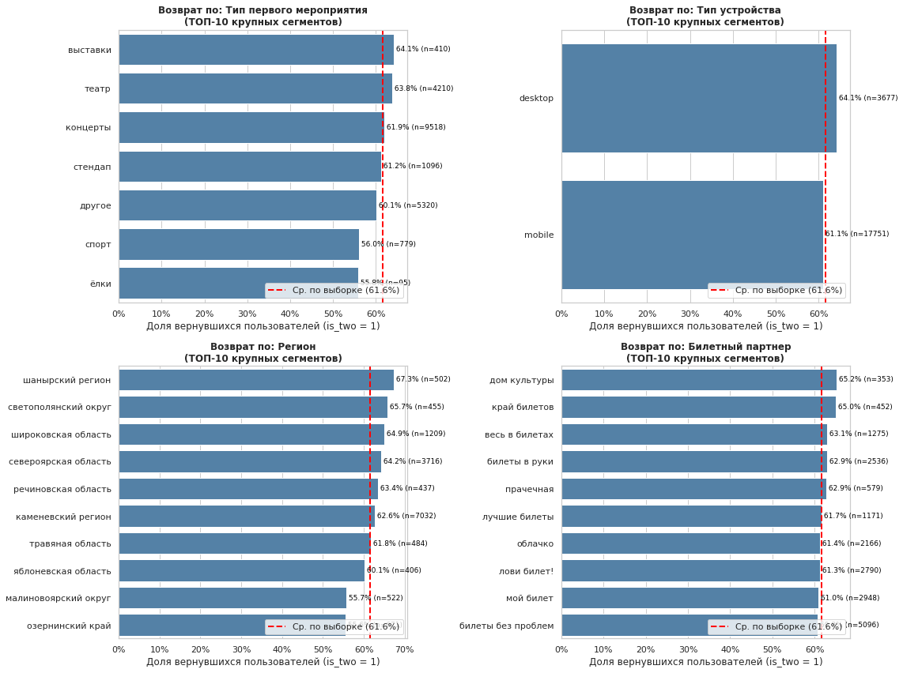
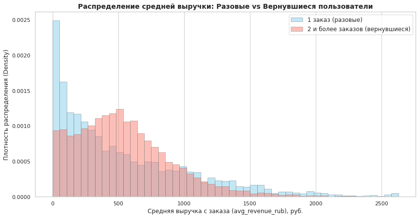
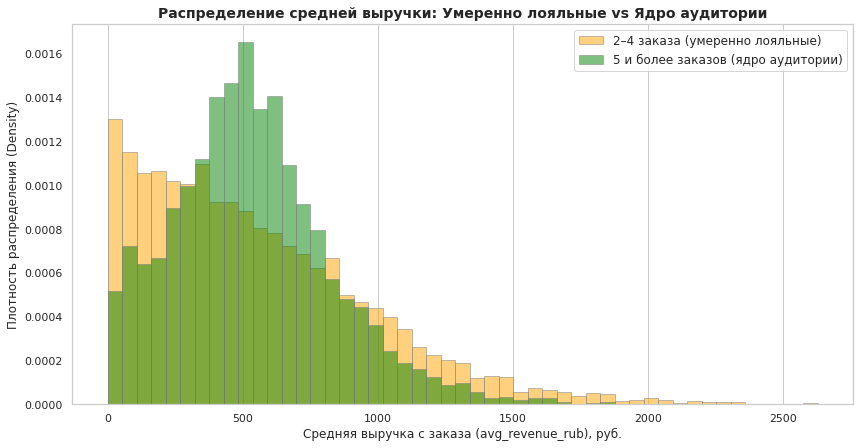
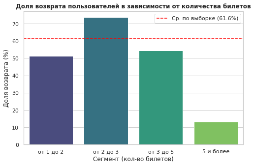
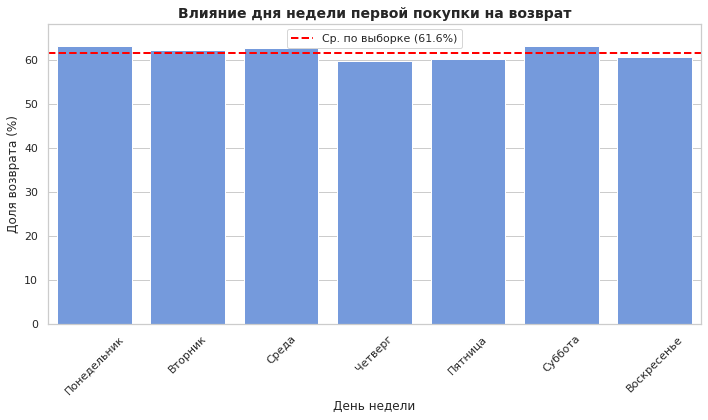
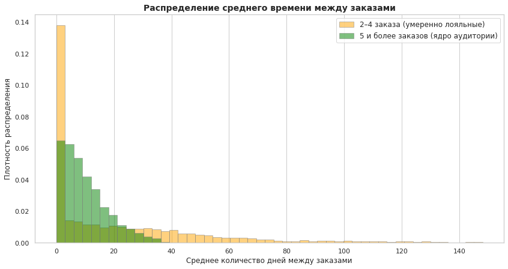
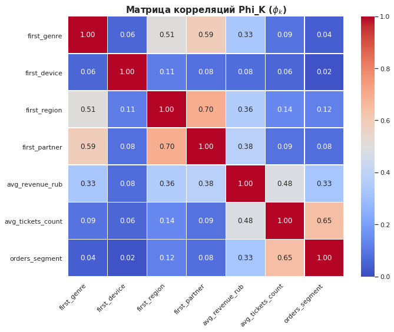

# Анализ лояльности пользователей Яндекс Афиши

Исследовательский аналитический проект, посвящённый поведению пользователей билетного сервиса и факторам, связанным с повторными покупками.

Цель исследования - определить характеристики пользователей, которые с большей вероятностью возвращаются на платформу и совершают новые заказы. Полученные результаты могут использоваться для сегментации аудитории, настройки маркетинговых коммуникаций и развития программ удержания пользователей.

## Цель проекта

Провести исследовательский анализ данных о заказах пользователей и определить признаки, связанные с повторными покупками.

В рамках проекта необходимо было:

* подготовить и очистить данные о заказах;
* привести выручку в разных валютах к единому формату;
* сформировать профиль каждого пользователя;
* сегментировать аудиторию по количеству заказов;
* изучить характеристики первого заказа;
* определить особенности пользователей, совершающих повторные покупки;
* исследовать связь выручки, количества билетов и временных характеристик с лояльностью;
* проверить статистические гипотезы;
* провести корреляционный анализ с использованием PhiK;
* сформировать рекомендации для маркетинга.

В рамках исследования **возвращающимся пользователем** считается клиент, совершивший два и более заказа.

## Данные

Исходные данные были получены из базы данных с помощью SQL.

В анализ вошла информация о заказах пользователей:

* идентификатор пользователя;
* идентификатор заказа;
* дата и время покупки;
* тип устройства;
* валюта и выручка;
* количество билетов;
* количество дней с предыдущего заказа;
* мероприятие и его категория;
* билетный партнёр;
* регион и город пользователя.

В исследование включены заказы, совершённые с мобильных устройств и компьютеров. События категории «фильм» были исключены в соответствии с условиями анализа.

Выручка была представлена в российских рублях и казахстанских тенге. Для сопоставимости заказов суммы в тенге были пересчитаны в рубли по курсу на дату покупки.

## Используемые технологии

**Работа с данными:**

* Python
* pandas
* NumPy

**Работа с базой данных:**

* SQL
* PostgreSQL
* SQLAlchemy

**Статистический анализ:**

* SciPy
* statsmodels
* PhiK

**Визуализация:**

* Matplotlib
* Seaborn

**Среда:**

* Jupyter Notebook

## Этапы исследования

### 1. Выгрузка данных

Данные были получены из нескольких таблиц базы данных с помощью SQL-запроса.

На этапе выгрузки:

* объединены данные о покупках, мероприятиях, городах и регионах;
* отобраны заказы с мобильных устройств и компьютеров;
* исключены мероприятия категории «фильм»;
* рассчитано количество дней между последовательными заказами пользователя.

Исходная выборка содержала **290 611 заказов**.

### 2. Предобработка данных

На этапе подготовки данных:

* проверены пропуски и дубликаты;
* оптимизированы типы данных;
* текстовые значения приведены к единому формату;
* выручка в тенге пересчитана в российские рубли;
* удалены отрицательные значения выручки;
* исследованы аномальные значения;
* экстремальные значения выручки ограничены по 99-му перцентилю.

99-й перцентиль выручки составил **2628,42 ₽**.

После фильтрации было удалено около **1,12% наблюдений**, а итоговая транзакционная выборка составила:

**287 363 заказа.**

## Формирование профиля пользователя

Транзакционные данные были агрегированы до уровня пользователя.

Для каждого клиента были рассчитаны:

* дата первого заказа;
* дата последнего заказа;
* устройство первой покупки;
* регион первой покупки;
* билетный партнёр первого заказа;
* категория первого мероприятия;
* общее количество заказов;
* средняя выручка с заказа;
* среднее количество билетов;
* средний интервал между заказами.

Дополнительно были созданы признаки:

* `is_two` - совершил ли пользователь два и более заказа;
* `is_five` - совершил ли пользователь пять и более заказов.

Первоначально было сформировано **21 838 пользовательских профилей**.

После анализа аномально активных пользователей и фильтрации по 99-му перцентилю итоговая выборка составила:

**21 428 пользователей.**

## Сегментация пользователей

Для анализа аудитория была разделена на три группы:

| Сегмент              | Количество заказов |
| -------------------- | -----------------: |
| Разовые пользователи |                  1 |
| Умеренно лояльные    |                2–4 |
| Ядро аудитории       |          5 и более |

После очистки данных:

* **38,42%** пользователей совершили только один заказ;
* **61,58%** совершили два и более заказов.

Таким образом, большая часть пользователей в исследуемой выборке возвращалась на платформу хотя бы один раз.

## Основные результаты

### Характеристики первого заказа

Распределение пользователей по характеристикам первой покупки оказалось неравномерным.

Основной точкой входа на платформу являются **концерты**:

**44,42% пользователей** совершили первый заказ именно на мероприятие этой категории.

Большинство первых покупок было совершено с мобильных устройств:

**82,84% пользователей.**

Наиболее представленным регионом оказался Каменевский регион — **32,82% пользователей**.

Среди билетных партнёров чаще всего встречались:

* «Билеты без проблем»;
* «Мой билет»;
* «Лови билет!».

### Возврат пользователей

Повышенная доля повторных заказов наблюдалась среди пользователей:

* впервые купивших билет на выставку;
* впервые совершивших заказ с компьютера;
* относящихся к отдельным региональным сегментам.

При этом такие группы меньше основной аудитории, поэтому высокую долю возврата в них необходимо интерпретировать с учётом размера сегмента.

Концерты и мобильные устройства не показывают максимальную долю возврата, однако именно через них приходит значительная часть пользователей платформы.

## Проверка статистических гипотез

### Гипотеза 1

Проверялось предположение:

> Пользователи, впервые купившие билет на спортивное мероприятие, совершают повторные покупки чаще пользователей, начавших с концертов.

Доля повторных покупок составила:

| Первое мероприятие | Доля возврата |
| ------------------ | ------------: |
| Спорт              |        55,97% |
| Концерты           |        61,91% |

Получено:

**p-value = 0,99948**

Статистических оснований утверждать, что пользователи спортивных мероприятий возвращаются чаще посетителей концертов, обнаружено не было.

### Гипотеза 2

Также проверялось предположение о том, что в регионах с большим количеством пользователей выше доля повторных заказов.

Коэффициент корреляции Пирсона:

**r = 0,187**

Получено:

**p-value = 0,23644**

Статистически значимой зависимости между размером пользовательской аудитории региона и долей возвратов обнаружено не было.

## Выручка и лояльность

Средняя выручка с заказа различается между разовыми и возвращающимися пользователями.

Медианная выручка:

| Группа     | Медианная выручка |
| ---------- | ----------------: |
| 1 заказ    |      **374,95 ₽** |
| 2+ заказов |      **495,92 ₽** |

Более детальная сегментация показала:

| Сегмент    | Медианная выручка |
| ---------- | ----------------: |
| 2–4 заказа |      **471,04 ₽** |
| 5+ заказов |      **513,09 ₽** |

Таким образом, более лояльные пользователи в исследуемой выборке в среднем совершают более дорогие покупки.

## Количество билетов и повторные покупки

Особенно заметные различия были обнаружены при анализе среднего количества билетов в заказе.

Наиболее высокая доля возврата наблюдалась среди пользователей, покупающих в среднем от **2 до 3 билетов**:

**73,56%**

Этот сегмент также является одним из крупнейших и включает значительную часть аудитории.

Для пользователей, приобретающих в среднем **5 и более билетов**, доля возврата составила только:

**13,06%**

При этом сегмент включает всего **467 пользователей**, поэтому его результаты следует рассматривать отдельно.

Низкая доля возврата может быть связана с групповыми, корпоративными или другими разовыми покупками.

## Временные характеристики

День недели первой покупки практически не связан с последующим возвращением пользователя.

Доля повторных покупок находится в относительно узком диапазоне:

**59,64–63,18%**

Несколько более высокая доля возврата наблюдается среди пользователей, впервые совершивших покупку в понедельник или субботу.

Более заметные различия обнаружены во времени между повторными покупками.

Пользователи с **5 и более заказами** чаще совершают покупки с относительно стабильными интервалами и особенно активно возвращаются в течение первых 10 дней.

Среди пользователей с **2–4 заказами** чаще встречаются длительные перерывы между покупками.

## Корреляционный анализ

Для исследования связей между количественными и категориальными характеристиками пользователей использовался коэффициент **PhiK**.

Наиболее заметная связь с количеством заказов была обнаружена у:

| Признак                       |      PhiK |
| ----------------------------- | --------: |
| Среднее количество билетов    | **0,384** |
| Средняя выручка               | **0,220** |
| Регион первой покупки         | **0,117** |
| Категория первого мероприятия |     0,028 |
| Билетный партнёр              |     0,027 |
| Тип устройства                |     0,027 |

После разделения пользователей на сегменты сила связи увеличилась:

| Признак                       | PhiK с сегментом |
| ----------------------------- | ---------------: |
| Среднее количество билетов    |        **0,647** |
| Средняя выручка               |        **0,326** |
| Регион первой покупки         |        **0,124** |
| Билетный партнёр              |            0,082 |
| Категория первого мероприятия |            0,040 |
| Тип устройства                |            0,018 |

Таким образом, наиболее заметно с уровнем пользовательской активности связаны **среднее количество приобретаемых билетов и средняя выручка с заказа**.

При этом выявленные статистические связи не позволяют делать вывод о причинно-следственном влиянии этих признаков на количество заказов.

## Визуализации

### Возврат пользователей по характеристикам первого заказа

### Средняя выручка: разовые и вернувшиеся пользователи

### Выручка по сегментам лояльности

### Количество билетов и вероятность возврата

### День недели первой покупки

### Интервалы между заказами

### Матрица связей PhiK

## Рекомендации

Основное внимание в маркетинговых коммуникациях стоит уделить пользователям, приобретающим в среднем **2–3 билета** и совершающим заказы примерно на **350–1000 ₽**.

Этот сегмент сочетает:

* значительный размер;
* высокую долю повторных покупок;
* относительно высокую выручку.

Для него могут быть наиболее актуальны:

* программы лояльности;
* персональные рекомендации мероприятий;
* специальные предложения для следующей покупки;
* напоминания о новых событиях.

Концерты и мобильные устройства следует рассматривать как основные точки привлечения аудитории. После первой мобильной покупки билета на концерт можно тестировать рекомендации похожих мероприятий и коммуникации, направленные на повторный заказ.

Пользователей, покупающих в среднем **5 и более билетов**, имеет смысл выделить в отдельный сегмент. Их поведение может отличаться от обычных частных клиентов и быть связано с групповыми или корпоративными покупками.

Для пользователей с **2–4 заказами** можно отдельно тестировать механики, сокращающие длительные интервалы между покупками:

* персональные подборки;
* уведомления о новых мероприятиях;
* предложения на основе истории покупок;
* ограниченные по времени промоакции.

Сегменты с повышенной долей возврата, например пользователи выставок или desktop-аудитория, можно использовать как отдельные группы для пилотных маркетинговых экспериментов.

## Ограничения исследования

При интерпретации результатов необходимо учитывать несколько факторов:

* исследование основано на наблюдательных данных и не доказывает причинно-следственные связи;
* отдельные сегменты пользователей имеют небольшой размер;
* высокая доля возврата в небольшом сегменте не обязательно означает его высокую ценность для бизнеса;
* экстремально активные пользователи были исключены из основной выборки;
* данные отражают поведение пользователей только в рамках рассматриваемого периода;
* для оценки эффективности маркетинговых рекомендаций необходимы последующие A/B-тесты.

## Итог

Исследование показало, что поведение возвращающихся пользователей отличается от поведения клиентов, совершивших только одну покупку.

Наиболее заметные различия связаны со **средним количеством билетов в заказе и размером выручки**.

Особенно интересным оказался сегмент пользователей, приобретающих в среднем **2–3 билета**: доля повторных заказов в нём достигает **73,56%**, а сам сегмент представляет значительную часть аудитории.

При этом признаки первого заказа — тип устройства, категория мероприятия или билетный партнёр — сами по себе значительно слабее связаны с количеством последующих покупок.

Результаты исследования могут использоваться как основа для более точной сегментации аудитории и последующего тестирования персонализированных маркетинговых механик.

